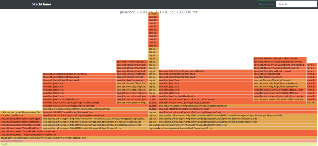

A simple (local, no-server) webapp visualizing the threads in a Java core dump using a flame graph.

You can use it at [mormegil-cz.github.io/stackflame](https://mormegil-cz.github.io/stackflame/). Your data is not uploaded anywhere, all processing takes place locally.

Supported formats
-----------------

* IBM WebSphere Java core dump
* IBM WebSphere SystemOut capturing hung threads

Credits
-------

Uses [d3-flame-graph](https://github.com/spiermar/d3-flame-graph) built on [d3.js](https://d3js.org/).
